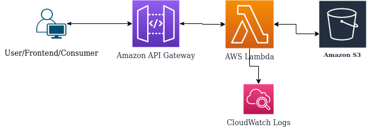

# serverless-api-aws

A sample REST API (WebService) hosted on AWS by using Serverless Technologies

Functionality: This API greets you with the supplied name in the query parameter and creates a file in the S3 bucket with the supplied 
name.

## Architecture



## Resiliency & Scalability

Since we are using managed serverless services, so this architecture gets following benefits

- AZ Failure tolerance
- Automatic scalable
- Save costs by paying only for the compute time you use—by per-millisecond—instead of provisioning infrastructure upfront for peak capacity

## Deployment

Web Service is deployed to AWS by [terraform](infra/).

Github Action [workflow](.github/workflows/CI.yaml) is configured to deploy changes automatically upon every push to main branch. 

### Pre requisites for automatic deployment

- AWS Credentials with required minimum permission . Configure credentials in Github Secerets. 

- Terraform Remote Backend. (S3 Bucket & DynamoDB Table)


## Test

After deployment, get the endpoint url from terraform output and access the web service api.

`curl -i https://xxxxxx.execute-api.eu-west-1.amazonaws.com/prod/?name=Jack`

```text
HTTP/2 200 
content-type: application/json
content-length: 26
date: Wed, 12 Jan 2022 10:51:20 GMT
x-amzn-requestid: 52566f51-a1a9-4dcf-a554-c07be49cbe0a
x-amz-apigw-id: L1DaTGNnDoEFklw=
x-custom-header: my custom header value
x-amzn-trace-id: Root=1-61deb2a8-3df7492c0fac049411351eb3;Sampled=0
x-cache: Miss from cloudfront
via: 1.1 a9120cc3ff449047c990e82a4d5566ba.cloudfront.net (CloudFront)
x-amz-cf-pop: OSL50-C1
x-amz-cf-id: xygXp2VySmBWHs9o6PjucmmWk6h3f-0fVft7F3rinIMaYlpyzCdIqw==

{"message":"Hello Jack !"}

```

